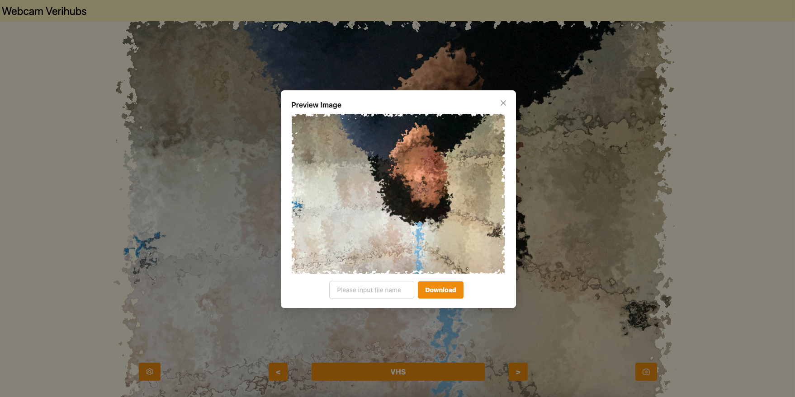
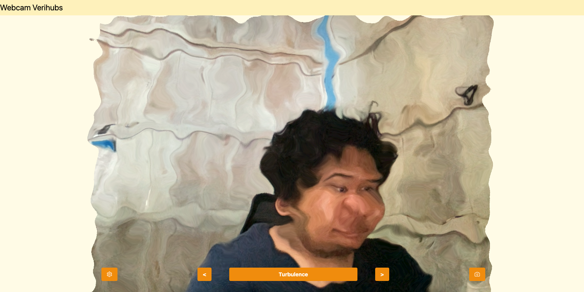

# WebCam Verihubs

Welcome to WebCam Verihubs, your go-to camera application for capturing and enhancing images! This React and TypeScript-powered application leverages the `react-webcam` library to seamlessly interact with your webcam, allowing you to apply various filters to your snapshots.

## Features

- **Capture Moments:** Effortlessly capture images from your webcam.
- **Filter Magic:** Apply a diverse range of filters to enhance your images.
- **Customization:** Personalize your experience with settings to mirror and flip the image.
- **Download Images:** Download your images to your local machine.

## Filters

Here's a list of filters you can apply to your images:

- Normal
- Oldskool
- Sepia
- Hulk
- Blur
- Bright
- Opacity
- Thermal
- Night
- Grain
- Old Grainy
- Turbulence
- Noise
- Convolve
- VHS

## Screenshots

## Libraries Used

- **React:** Powering the intuitive user interface.
- **TypeScript:** Adding a layer of static types for enhanced JavaScript.
- **react-webcam:** Seamless image capture from your webcam.
- **react-device-detect:** Smart detection for mobile devices.
- **@ant-design/icons:** Elevating the visual experience with icons.

## How to Run

1. **Clone the Repository:** Get started by cloning this repository.
2. **Install Dependencies:** Run `yarn install` to install the necessary dependencies.
3. **Start the Server:** Launch the development server with `yarn start`.

Now you're all set to explore the exciting features of WebCam Verihubs!
